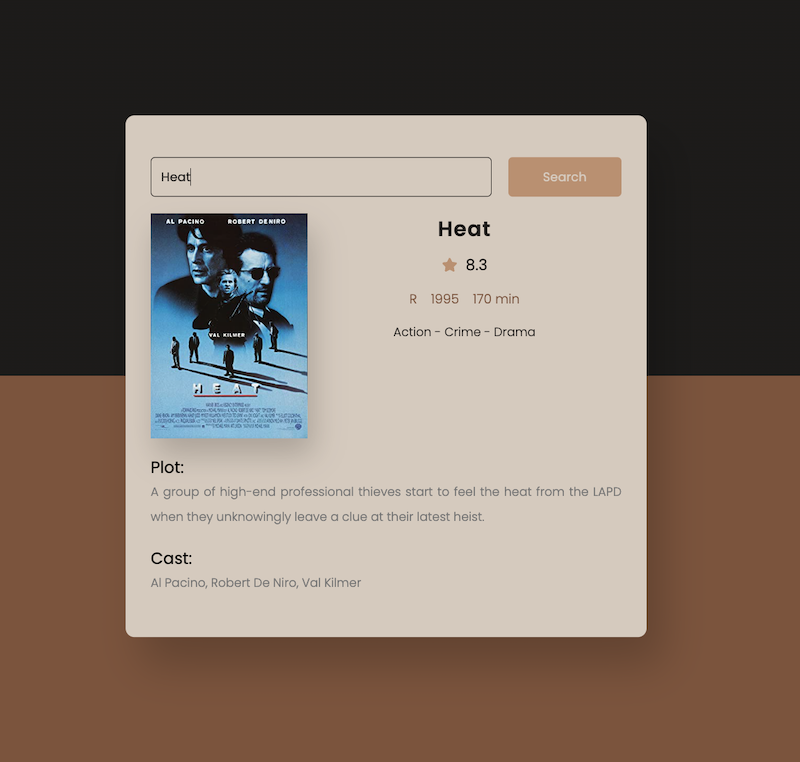
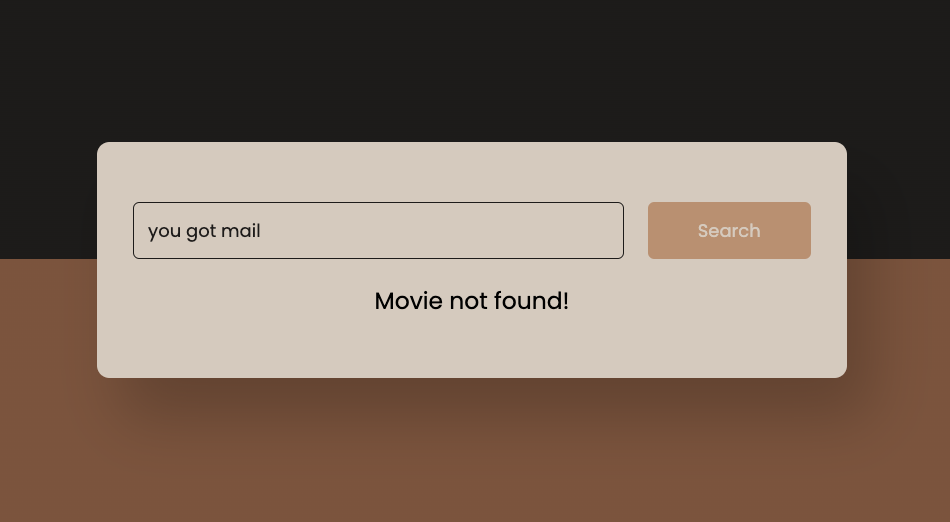

# React Movie Guide
React Movie Guide outputs movie info after a search using the omdbapi.

## Technologies Used

* HTML5
* CSS3
* JavaScript
* React
* [Omdb API](https://www.omdbapi.com/)
* [icons](hhttps://fontawesome.com/icons)

## Screenshots
### Default on Load

### Movie Search

### Movie Not Found

## Getting Started
* [click here]() to see app!